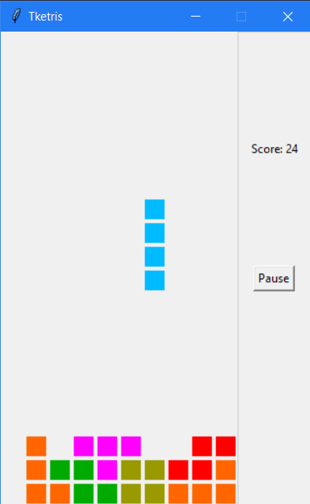

# Tketris

Tketris is Tetris implemented in Python and Tkinter

## Installation

NOTE: Works for Python 3

Make sure you have `pip` installed. Type `pip install tketris` to install

## Usage

Just type `python -m tketris` and start playing!

|     Key     |   Control  |
|:-----------:|:----------:|
| Left Arrow  | Move Left  |
| Right Arrow | Move Right |
| Up Arrow    | Rotate     |
| Down Arrow  | Soft Drop  |

## Changelog

### 1.0.1

- Fixed bug where minos change shape at top and left
- Fixed bug where minos clip side on rotate

### 1.0.0

- Game Board
- Random Tiles
- Move down, left, right
- Rotate
- Soft drop
- Score
- Game Over
